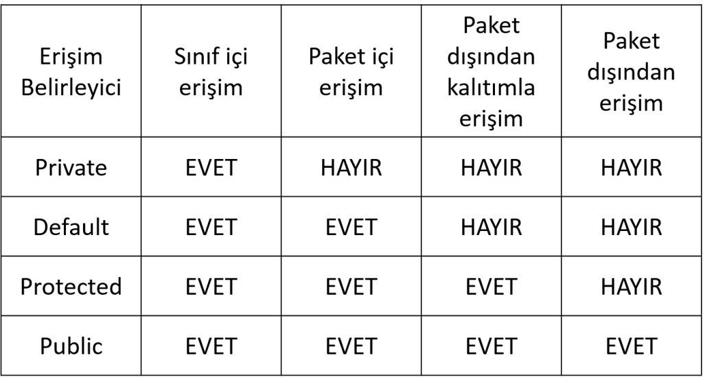

# Java Erişim Belirleyicileri

Java programlama dilinde, erişim belirleyiciler sınıflar, yöntemler ve değişkenler için erişim düzeyini kontrol etmek amacıyla kullanılır. Bu belirleyiciler sayesinde, bir bileşenin hangi kapsamda ve hangi koşullarda erişilebilir olduğunu belirlemek mümkündür.

## Erişim Belirleyicileri Türleri

Java'da dört farklı erişim belirleyici türü bulunur:

1. **public**: Her yerden erişime izin verir. Sınıf, yöntem veya değişken, projenin herhangi bir yerinden erişilebilir olur.

2. **protected**: Aynı paket içinden veya alt sınıflardan erişime izin verir. Bu belirleyici, nesnenin sadece aynı paket içinde veya alt sınıflardan erişilebilmesini sağlar.

3. **default (package-private)**: Herhangi bir erişim belirleyici belirtilmediğinde varsayılan olarak kullanılır. Yani, sadece aynı paketten erişime izin verir.

4. **private**: Sadece aynı sınıf içinden erişime izin verir. Diğer sınıflardan erişime tamamen kapatır.

## Nasıl Kullanılır?

Sınıflarınızı ve sınıf üyelerinizi (yöntemler, değişkenler) düzenlerken doğru erişim belirleyicilerini kullanmak önemlidir. Bu, hem kodunuzun düzgün çalışmasını sağlar hem de güvenlik açısından önemlidir.

Örneğin, eğer bir sınıfın veya yöntemin herkes tarafından erişilebilmesini isterseniz `public` erişim belirleyicisini kullanabilirsiniz. Eğer sınıfın veya yöntemin sadece alt sınıflardan erişilmesini isterseniz `protected` kullanabilirsiniz. Aynı paket içinden erişim için herhangi bir belirleyici belirtmezseniz, varsayılan erişim belirleyici olan `default` kullanılır. Aynı sınıf içinden erişimi sınırlamak için ise `private` kullanabilirsiniz.

## Örnekler


### Public Erişim Belirleyici

```java
public class PublicExample {
    public void publicMethod() {
        // Herkes tarafından erişilebilir.
    }
}
```
### Protected Erişim Belirleyici
```java
class Parent {
    protected void protectedMethod() {
        // Alt sınıflar veya aynı paket içinden erişilebilir.
    }
}
class Child extends Parent {
    void childMethod() {
        protectedMethod(); // Alt sınıf olduğu için erişilebilir.
    }
}
```
###  Default Erişim Belirleyici
```java
class DefaultExample {
    void defaultMethod() {
        // Sadece aynı paket içinden erişilebilir.
    }
}
```
###  Private Erişim Belirleyici
```java
public class PrivateExample {
    private void privateMethod() {
        // Sadece aynı sınıf içinden erişilebilir.
    }
}
```


