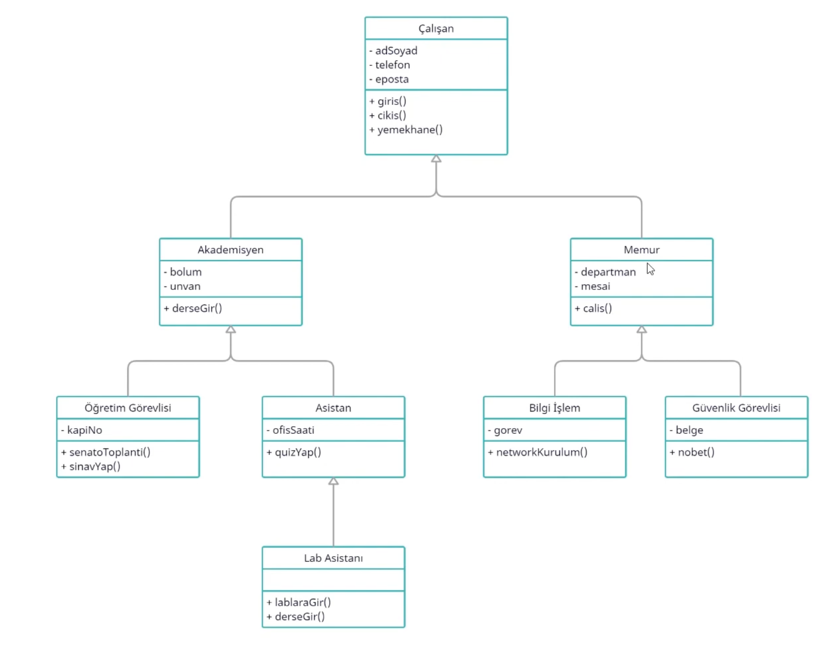

# Java Sınıflar Arası İlişkiler: Kalıtım (Inheritance)

Bu döküman, Java programlama dilinde <span style="color:blue">"kalıtım" ilişkisini</span> açıklamaktadır. Kalıtım, bir sınıfın başka bir sınıfın özelliklerini ve davranışlarını devraldığı bir nesne yönelimli programlama (OOP) kavramıdır. Bu sayede kodun yeniden kullanılabilirliği artar ve yapısal düzen sağlanır.

## Kalıtım (Inheritance) Nedir?

Kalıtım, bir sınıfın başka bir sınıftan özellikleri (alanlar) ve davranışları (metotlar) <span style="color:green">miras alarak kullanmasını</span> sağlayan bir ilişki türüdür. Bir sınıfın başka bir sınıfı kalıtım alabilmesi için <span style="color:purple">`extends`</span> anahtar kelimesi kullanılır.

**Kalıtım, <span style="color:blue">"is-a" ilişkisi</span>** olarak da düşünülebilir. Yani, alt sınıf bir üst sınıfın bir türüdür ve üst sınıfın sahip olduğu özellikleri ve davranışları miras alır.

## Örnek: Hayvanlar Hiyerarşisi

Aşağıdaki örnek, farklı hayvanların kalıtım hiyerarşisini göstermektedir:

```java
class Hayvan {
    String tur;

    void hareketEt() {
        System.out.println("Hayvan hareket ediyor.");
    }
}

class Kus extends Hayvan {
    void uc() {
        System.out.println("Kuş uçuyor.");
    }
}

class Kopek extends Hayvan {
    void havla() {
        System.out.println("Köpek havlıyor.");
    }
}
```
### Package içerisideki sınıfların kalıtım aldıkları sınıfların şablonunu göstermekte.
